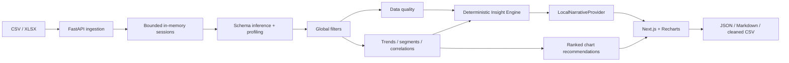

# AutoInsight Dashboard

[](https://github.com/Dark0ne1/autoinsight-dashboard/actions/workflows/ci.yml)

**Upload any CSV or Excel file and automatically turn it into an interactive analytical dashboard.**

Business exports rarely arrive with the same schema. AutoInsight profiles their values, infers column roles, ranks useful charts and generates evidence-backed statistical findings—without predefined metric names or an AI API key.

Built as an open-source portfolio project for marketing analytics and technical marketing: Python statistics, data quality, API design, automated analysis and a working Next.js interface in one inspectable pipeline.

This repository is a portfolio showcase with screenshots, source code and a test dataset. There is no hosted application; GitHub Actions only runs tests and builds. Run it locally to try the dashboard.

## Features

- CSV upload (UTF-8 / Windows-1251; comma, semicolon, tab or pipe) and XLSX worksheet selection.
- Value-based schema inference: numeric, datetime, boolean, identifier, percentage, currency-like, categorical, high-cardinality category and text. Separate constant and mostly-null flags.
- Data overview, numeric quantiles, category frequencies, long tail, missingness and duplicate detection.
- Documented 0–100 quality score with per-column observations and penalty breakdown.
- Ranked recommendations: at most eight time-series, segment, distribution and relationship charts.
- Adaptive calendar aggregation, rolling average, conservative anomaly markers and equal-period comparison.
- Category–metric aggregates and between-group variance; Pearson and Spearman correlations.
- Up to ten deterministic insights with structured evidence and importance scores.
- Global categorical, numeric and date filters; manual charts with aggregation and scatter grouping.
- Searchable, sortable, paginated data explorer; light/dark mode and responsive layout.
- English / Russian interface switch, including analytical findings; original field names and category values remain intact.
- Product-first empty workspace with file input, explicitly labeled demo KPIs, trend, segments and column profiles. Graphite / cobalt palette and locally bundled Manrope / IBM Plex Mono fonts.
- JSON insights, Markdown analysis and normalized, deduplicated, formula-safe CSV export.
- Seeded marketing demo with intentional quality issues and a spike.

## Screenshots


Screenshots show the running application, not mockups. See [validation results](docs/VALIDATION.md) for the tested scenarios and reproducible commands.

## Documentation

- [Code guide / документация по коду](docs/CODE_GUIDE.md): pipeline, modules, contracts, localization and extension points.
- [Deployment / развёртывание](docs/DEPLOYMENT.md): Windows/Linux, native production, Docker Compose, VPS and troubleshooting.
- [GitHub description / описание проекта](docs/GITHUB_DESCRIPTION.md): About, topics and portfolio copy.
- [Validation](docs/VALIDATION.md): completed checks, browser scenarios and measured limitations.

## Architecture



```text
backend/
  app/
    analytics/     # inference, profiles, quality, anomalies, charts, insights
    services/      # ingestion, sessions, orchestration, narrative provider
    api.py         # upload, analyze, rows, charts, exports
    models.py      # validated request schemas
    main.py        # app, request byte limits, error handling
  tests/           # statistical checks and complete API workflows
  demo/marketing.csv
frontend/
  app/             # Next.js app and design tokens
  components/      # upload, filters, charts, explore, raw data
  lib/             # typed response contracts and API client
scripts/generate_demo.py
```

One FastAPI process keeps datasets in memory for one hour, with at most eight sessions and a combined 512 MiB retained-data budget. There is no database, queue, persistent upload directory or external analytics service. The frontend forwards `/api` to FastAPI through Next.js rewrites. `NarrativeProvider` is a narrow extension point; `LocalNarrativeProvider` is the only implementation. Future LLM providers should consume findings, never invent evidence.

## How it works

1. Validate extension, byte size and workbook expansion before reading a table.
2. Inspect values, missingness, cardinality and formats. Names provide supporting identifier hints only; metric names are not hard-coded.
3. Normalize inferred numeric values and dates. Keep identifier strings, including leading zeros from CSV.
4. Apply dashboard filters to the same normalized frame used by charts, insights, KPIs, the table and exports.
5. Compute quality, distributions, group aggregates and paired correlations. Rank useful candidates instead of plotting every combination.
6. Generate structured findings with `type`, `importance`, `title`, `description` and `evidence`. Render a local summary and interactive chart configs.

### Statistical choices

- Dates: recognize calendar-like strings, require at least 80% parse success, normalize to UTC. Date-only upper bounds include the full day. Ambiguous dates follow pandas parsing conventions; ISO dates are preferable.
- Numeric strings: require 85% conversion success. Currency symbols and percent signs are removed; percentages become fractions and default to **mean**, not sum. A comma without a dot is treated as a decimal separator. Failed conversions become missing values.
- IDs: explicit ID/code name hints, UUID values and unique consecutive integer sequences are excluded from metrics. This is a heuristic; unique measurements can resemble keys. High-cardinality text does not automatically become an ID.
- Category roles: at most 50 distinct values for automatic segment charts. Wider dimensions remain available in manual exploration and profiles.
- Time: daily buckets up to 90 days, weekly up to 730 days, monthly beyond that. Empty sum buckets are missing, not invented zeros. Compare up to 12 consecutive completed buckets against an equally sized preceding period; exclude the newest, possibly partial bucket and suppress comparisons containing gaps. Completeness is approximate because collection schedules are unknown.
- Anomalies: a point must cross both a preceding seven-bucket rolling baseline (absolute z-score > 3, or departure from a flat baseline) and global 3 × IQR fences. At least eight buckets are needed for fences. These are review candidates, not proof of fraud or a causal explanation.
- Segments: count, sum, mean, median and share of the entire filtered metric total (including records without a category). Rank by eta squared (between-group variance / paired-observation variance), an effect size rather than a p-value. Shares are shown only for a positive, non-negative total.
- Relationships: Pearson and Spearman with at least ten paired values and non-constant columns, ranked by absolute Spearman effect size. No multiple-testing significance claim. **Correlation does not imply causation.**
- KPI aggregation is a generic default, not business semantics. Spend, rates, balances and prices may need different aggregations; choose one in Explore mode. Currency-like values do not establish a common currency.

### Data Quality Score

```text
score = max(0, 100 − 40M − 25D − 10C − 15T − 10O)
M = normalized missing cells / all cells
D = duplicate normalized rows / all rows
C = constant non-null columns / all columns
T = newly missing cells caused by failed conversion / all cells
O = extreme numeric outlier cells / non-null numeric cells
```

Round to one decimal. Empty datasets score zero. Failed conversions affect both missingness and the conversion penalty intentionally. Inferred dates are informational and do not lower the score. Original missingness is retained per field, while normalized missingness drives the score. The score describes tabular hygiene, not factual accuracy, representativeness or business correctness.

## Tech stack

Next.js App Router, TypeScript, React, Tailwind CSS and Recharts; Python 3.12+, FastAPI, pandas, NumPy, SciPy and openpyxl. Tests use the Python standard library plus FastAPI's HTTP test client. No ML model, mandatory LLM or new infrastructure service.

## Local development

```sh
git clone https://github.com/Dark0ne1/autoinsight-dashboard.git
cd autoinsight-dashboard
```

### Docker

```sh
docker compose up --build
```

Open [localhost:3000](http://localhost:3000). API documentation: [localhost:8000/docs](http://localhost:8000/docs). Ports bind to localhost. A `.env` file is optional; copy `.env.example` if you want to change the upload limit or allowed origins. The browser upload ceiling is 100 MiB. A backend limit below this is respected by the API.

### Without Docker

Use Python 3.12+ and Node.js 22+. From the repository root:

```sh
python -m venv .venv
# Windows PowerShell:
.venv\Scripts\Activate.ps1
# macOS/Linux: source .venv/bin/activate
pip install -r backend/requirements.txt
cd backend
python -m uvicorn app.main:app --reload --port 8000
```

In another terminal:

```sh
cd frontend
npm ci
npm run dev
```

On Windows use `npm.cmd` if PowerShell blocks the npm script shim. The default rewrite destination is `http://127.0.0.1:8000`. Set `API_INTERNAL_URL` before starting/building Next.js when changing the API address; rewrites are embedded in production builds. To access FastAPI directly from the browser instead, set `NEXT_PUBLIC_API_URL` before the frontend build and add the frontend origin to `CORS_ORIGINS`.

### Checks and production build

```sh
cd backend
python -m unittest discover -s tests -v
cd ../frontend
npm run lint
npm run typecheck
npm run test:locale
npm run build
npm start
```

GitHub Actions runs backend tests, frontend lint, type checking, localization checks and the production build. The analytics tests exercise marketing/time-series, sales/categories, no-date, mostly-null, numeric-only, text/high-cardinality, single-column, empty and non-finite datasets. API checks cover CSV → filters → chart/table → exports and multi-sheet XLSX.

## Example analysis

Click **Use demo dataset**. The seed-42 sample has 728 rows, ten columns, six numeric metrics, three categorical dimensions and one date dimension covering January–June 2026. It contains eight repeated records, missing region values and an injected revenue spike.

Try filtering `channel` to `Organic`, viewing segment evidence, creating a mean-revenue bar by region, and exporting Markdown. Regenerate the synthetic file with `python scripts/generate_demo.py`. None of these column names appear in the schema-agnostic engine.

### Additional test dataset

[autoinsight_demo_marketing_dataset.csv](datasets/autoinsight_demo_marketing_dataset.csv) is included unchanged as an additional upload fixture: 1,101 rows, 17 fields, January–September 2026. Download it and choose it in the upload screen. It exercises marketing dimensions, six numeric metrics, a Boolean promo flag, creative identifiers, notes, missing values and duplicate records. See [dataset notes and verified analysis](datasets/README.md).

## API

| Method | Endpoint | Purpose |
| --- | --- | --- |
| POST | `/api/upload` | Multipart `file`; returns session ID and sheet names |
| POST | `/api/demo` | Load the synthetic marketing data |
| POST | `/api/datasets/{id}/analyze` | `{sheet?, date_column?, filters: []}` |
| POST | `/api/datasets/{id}/chart` | Analysis request plus `{type, x, y?, aggregation, group_by?}` |
| POST | `/api/datasets/{id}/rows` | Analysis request plus search, sort and pagination |
| POST | `/api/datasets/{id}/export` | Analysis request plus `format`: json/csv/markdown |
| DELETE | `/api/datasets/{id}` | Remove a session |
| GET | `/api/health` | Health check |

Filters: `{column, kind: "categorical", values: ["A"]}`, `{column, kind: "numeric", min: 0, max: 100}` or `{column, kind: "date", min: "2026-01-01", max: "2026-02-01"}`. Constraints and schemas are available in Swagger. Manual bars group by X; scatter supports a separate `group_by` field.

## Privacy and safety

Uploads stay in the backend process and expire after one hour or disappear on restart. Reset removes the active dataset. Files are not transmitted to an LLM. XLSX uses cached formula values (`data_only`), never evaluates formulas, and rejects excessive decompressed size. CSV export prefixes spreadsheet-formula-like strings with an apostrophe. Cleaned CSV trims strings, normalizes inferred types and removes exact normalized duplicate rows; it does not impute missing values, remove outliers or repair business data. Legitimate repeated events may be deduplicated, so keep your original file.

## Limitations

- Local, single-worker MVP. No authentication, sharing or persistent projects. Do not expose to untrusted public traffic without authentication, rate limits and shared session storage. The random session ID is a bearer capability, not an account permission system.
- Uploads up to 100 MiB are accepted, but highly expanded or wide files can hit memory/row/column limits. At most 1,000,000 rows, 200 fields, 300 MiB decompressed XLSX and 512 MiB retained session data. Parsing and concurrent analytics need additional transient memory; a 100 MiB input is not guaranteed to fit. Synthetic 50 and 95 MiB CSV uploads were verified locally; [benchmark details](docs/VALIDATION.md) are shape-specific, not a general throughput guarantee.
- Profiling and filtering currently scan the full selected sheet. Correlations use at most 20,000 deterministic sampled rows and twelve ranked metrics; segments consider eight dimensions and six metrics. Scatter displays at most 1,000 points. Limits and sampling are visible in the interface and exports.
- Type inference uses bounded evidence (first 2,000 non-null values) and heuristics; no semantic certainty for arbitrary business fields. Currency thousands separators and locale-specific mixed date conventions need explicit preprocessing. No user type override yet.
- Numeric charts assume reasonable float64 magnitudes. Multi-currency summation, cumulative counters, balances, weighted percentages and nested data require domain decisions. The default KPI sum is not universally meaningful.
- Charts are capped at eight recommendations; degenerate/text-only datasets may produce fewer. Insights are capped at ten but never padded to five when evidence is insufficient.
- Grouped scatter plots show at most ten groups. Manual bar charts show the top twelve groups; the underlying dataset is retained.
- The newest time bucket is excluded from period comparisons but still plotted. Calendar gaps and seasonality can reduce anomaly reliability.
- XLSX formula results may be missing if the source application did not cache them. No support for macros, password-protected workbooks, PDF export or `.xls`.
- The optional LLM provider is an extension point only; `.env.example` placeholders do not activate an integration.

## Roadmap

- Manual semantic-role and locale overrides with aggregation suggestions.
- Streaming ingestion and measured 50–100 MiB benchmarks.
- Schema-level caches for faster repeated filtering.
- Seasonality-aware comparisons and segment minimum-sample controls.
- Optional grounded narrative provider with explicit user consent.
- Saved workspaces and secure sharing when a real persistence use case exists.

## License

[MIT](LICENSE). Contributions with reproducible datasets and a failing regression check are welcome.
