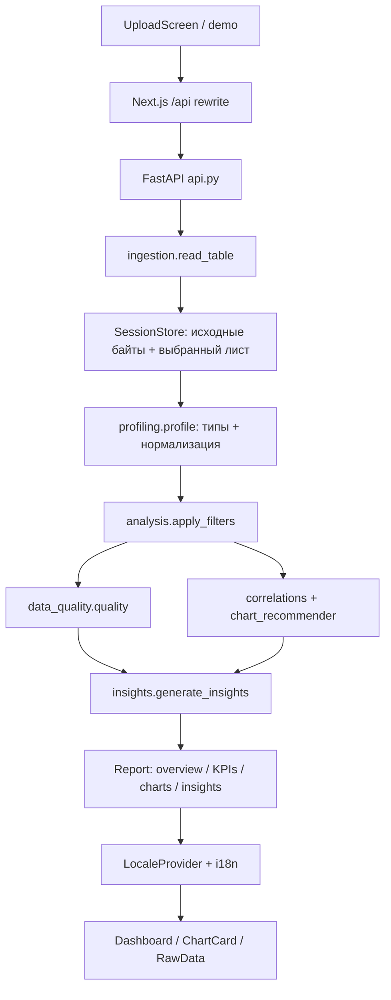

# Документация по коду AutoInsight

AutoInsight принимает CSV/XLSX произвольной структуры и строит аналитический workspace. Схема определяется по значениям, наблюдения формируются статистическими правилами. Внешний ИИ не используется.

## Поток данных



## Карта backend

Все пути ниже указаны от корня репозитория.

| Файл | Ответственность |
| --- | --- |
| `backend/app/main.py` | FastAPI, CORS, ограничение фактических байтов upload до разбора multipart, обработчики ошибок |
| `backend/app/api.py` | HTTP маршруты, выбор листа, ручной график, строки, экспорт; `load_frame` использует кеш выбранного листа |
| `backend/app/models.py` | Pydantic-контракты и ограничения запросов: фильтры, графики, пагинация, форматы экспорта |
| `backend/app/services/ingestion.py` | CSV: кодировки и разделитель; XLSX: листы и распакованный размер; очистка заголовков и строк |
| `backend/app/services/sessions.py` | `Dataset`, `SessionStore`, TTL, потолок памяти, блокировка доступа |
| `backend/app/services/analysis.py` | `analyze` объединяет весь pipeline; `apply_filters` общий для анализа, таблицы, графиков и экспорта; `json_safe` заменяет NaN/Infinity на null |
| `backend/app/services/narrative.py` | Текстовое резюме по результатам. Реализован только `LocalNarrativeProvider` |
| `backend/app/analytics/semantic_types.py` | `infer_column`: смысловой тип и нормализованные значения. Название поля — вспомогательный сигнал для идентификаторов |
| `backend/app/analytics/profiling.py` | `profile`, числовые квантили, частоты категорий и длинный хвост |
| `backend/app/analytics/data_quality.py` | Пропуски, повторы, константы, преобразования, выбросы и оценка качества |
| `backend/app/analytics/anomalies.py` | Робастные границы 3 × IQR и временные отклонения от предыдущих периодов |
| `backend/app/analytics/charts.py` | Построение временных, сегментных, частотных графиков, гистограмм и scatter |
| `backend/app/analytics/correlations.py` | Pearson / Spearman для допустимых пар числовых метрик |
| `backend/app/analytics/chart_recommender.py` | Отбор и ранжирование полезных графиков, максимум восемь |
| `backend/app/analytics/insights.py` | Наблюдения с importance и структурированным evidence, максимум десять |

## Поведение аналитики

1. `read_table` сохраняет CSV как исходные объектные значения; это помогает не потерять ведущие нули идентификаторов. Пробелы по краям строк удаляются, пустые строки становятся пропусками. Повторяющиеся заголовки получают уникальные суффиксы.
2. `profile` распознаёт numeric, datetime, boolean, identifier, percentage, currency-like, categorical, high-cardinality category и text. Тип определяется по ограниченной выборке до 2 000 непустых значений; это эвристика.
3. `analyze` применяет фильтры после нормализации. При фильтрации типы остаются стабильными, а статистика, пропуски и флаги констант пересчитываются по выбранным строкам.
4. Основная дата задаётся пользователем или выбирается по числу заполненных значений. Числовые кандидаты ранжируются по заполненности и вариативности.
5. KPI: сумма для обычных числовых метрик, среднее для percentages. Доли процентов хранятся как 0–1; UI показывает 0–100%. Выбор агрегации требует понимания предметной области.
6. Временной ряд агрегируется по дням, неделям или месяцам. Сравниваются равные завершённые интервалы; самый новый период исключается из сравнения, но остаётся на графике.
7. Оценка качества = 100 минус взвешенные доли: пропуски 40, повторы 25, константы 10, неудачные преобразования 15, экстремальные выбросы 10. Пустая таблица получает 0. Это гигиена таблицы, а не доказательство бизнес-достоверности.
8. `generate_insights` не объясняет причины изменений. Каждое наблюдение содержит проверяемые числа; корреляция сопровождается оговоркой о причинности.

## Карта frontend

| Файл | Ответственность |
| --- | --- |
| `frontend/app/page.tsx` | Состояние датасета, Report, Query, загрузки, ошибок, темы и навигации; вызовы анализа и сброса |
| `frontend/app/layout.tsx` | Metadata, локальные шрифты и общий `LocaleProvider` |
| `frontend/app/globals.css` | Цветовые токены, светлая/тёмная темы, сетки, состояния, адаптивность и reduced motion |
| `frontend/components/Sidebar.tsx` | Навигация, новый анализ, имя файла и переключатель темы |
| `frontend/components/UploadScreen.tsx` | File input, drag/drop, состояние обработки, демоданные |
| `frontend/components/WorkspacePreview.tsx` | Иллюстрация результата в hero: графики Recharts и явно отмеченные примерные значения; не анализ демо или загруженного файла |
| `frontend/components/ChartCard.tsx` | Recharts, подписи, визуализация и раскрываемая таблица точек |
| `frontend/components/Filters.tsx` | Категориальные, числовые и календарные границы общих фильтров |
| `frontend/components/Explore.tsx` | Запросы ручных графиков. Перестраивает их при изменении Query |
| `frontend/components/RawData.tsx` | Поиск с задержкой 250 мс, сортировка и страницы по 20 строк |
| `frontend/components/LocaleProvider.tsx` | EN/RU, `document.lang`, общий `t()` и форматирование чисел |
| `frontend/lib/i18n.ts` | Словарь, локализованные заголовки графиков, summary и наблюдения из evidence |
| `frontend/lib/api.ts` | JSON/multipart HTTP, ошибки, скачивание файлов, удаление сессии |
| `frontend/lib/types.ts` | TypeScript-контракты Report, Chart, Column, Insight, Filter, Query, Upload |
| `frontend/next.config.ts` | Same-origin `/api` → backend, standalone-сборка для Docker |

### Состояние и отмена запросов

`Home.run` увеличивает `requestVersion`: устаревший ответ не заменяет более новый анализ. `Explore` и `RawData` используют `AbortController` при изменении параметров или размонтировании. При новом файле старый Report и Query сбрасываются; кнопка нового анализа удаляет активную серверную сессию.

### Локализация

Первый язык — English. Тумблер в верхней панели меняет язык без повторного анализа: Report, Query, ручные графики, поиск и страница таблицы сохраняются. Язык и тема действуют до перезагрузки страницы; сохранения предпочтений в storage нет.

Названия полей, категории и исходные значения не переводятся. Значения API (`bar`, `mean`, `categorical` и т. п.) остаются одинаковыми в обоих языках; переводятся только подписи. Структурированное evidence показывается как исходный JSON. JSON/Markdown экспорт использует английское резюме backend независимо от языка UI; CSV содержит нормализованные исходные поля.

Для нового текста добавьте английский ключ и русский перевод в `messages`, затем используйте `t("English key")`. Для нового типа наблюдения обновите `insightText` по его evidence; не вычисляйте статистику повторно на клиенте.

## API

FastAPI Swagger: `http://localhost:8000/docs`. Следующие пути доступны напрямую на :8000 и через Next.js на :3000.

| Метод / путь | Тело / результат |
| --- | --- |
| GET `/api/health` | `{ "status": "ok" }` |
| POST `/api/upload` | Multipart `file`; возвращает `{id, filename, size, sheets}` |
| POST `/api/demo` | Создаёт отдельную сессию синтетических демоданных |
| POST `/api/datasets/{id}/analyze` | `{sheet?, date_column?, filters: []}` → Report |
| POST `/api/datasets/{id}/chart` | Query + `{type, x, y?, aggregation, group_by?}` → Chart |
| POST `/api/datasets/{id}/rows` | Query + `{page, page_size, search, sort?, descending}` → `{total, columns, rows}` |
| POST `/api/datasets/{id}/export` | Query + `{format: "json" / "csv" / "markdown"}` → файл |
| DELETE `/api/datasets/{id}` | Удаление сессии, идемпотентно |

Пример анализа с фильтром:

```json
{
  "filters": [
    {"column": "channel", "kind": "categorical", "values": ["Organic"]},
    {"column": "revenue", "kind": "numeric", "min": 0, "max": 10000}
  ]
}
```

Границы даты включительные. Верхняя граница формата `YYYY-MM-DD` включает весь день UTC. Фильтры объединяются по AND; `values` внутри категориального фильтра — по OR. До 20 фильтров, 100 значений категории, 100 строк на страницу API (UI использует 20). Search — подстрока без regex, без учёта регистра.

## Ограничения и хранение

- Один процесс backend; сессии в памяти, без БД и файлового хранилища. До восьми сессий, TTL один час от создания, общий бюджет 512 MiB учитывает байты файла и кеш листа. Удаление просроченных записей происходит при обращении к хранилищу.
- Upload по умолчанию до 100 MiB; до 1 000 000 строк и 200 колонок. XLSX: до 300 MiB распакованных данных и 10 000 ZIP entries. Память временных аналитических копий не входит в бюджет retained sessions.
- Корреляции: до 12 метрик и фиксированная выборка до 20 000 строк. Сегменты: до восьми измерений и шести метрик. Scatter: до 1 000 точек и десяти групп. Сегментные графики: 12 ведущих групп.
- CSV export удаляет точные нормализованные повторы и экранирует строки, похожие на spreadsheet-формулы. Пропуски не заполняет, выбросы не удаляет. XLSX формулы не исполняются, используются сохранённые результаты.
- Нет авторизации, постоянных проектов и общего хранилища. Случайный ID сессии является ключом доступа. Несколько workers/реплик без общего SessionStore не поддерживаются.

## Изменения и проверки

Новый смысловой тип проходит через `semantic_types` → `profiling` → наборы METRICS/DIMENSIONS → charts/insights. Новый контракт API требует согласованного изменения Pydantic и `lib/types.ts`. Новое аналитическое правило следует проверять на небольшом наборе с известным результатом в существующих unittest.

```sh
cd backend
python -m unittest discover -s tests -v
cd ../frontend
npm run lint
npm run typecheck
npm run test:locale
npm run build
```

На Windows используйте `npm.cmd`. `scripts/check_localization.cjs` проверяет словарь, использование evidence, неизменность оригинальных полей и EN/RU. Интеграционные сценарии и фактические ограничения проверки перечислены в [VALIDATION.md](VALIDATION.md). Инструкция запуска — [DEPLOYMENT.md](DEPLOYMENT.md).
